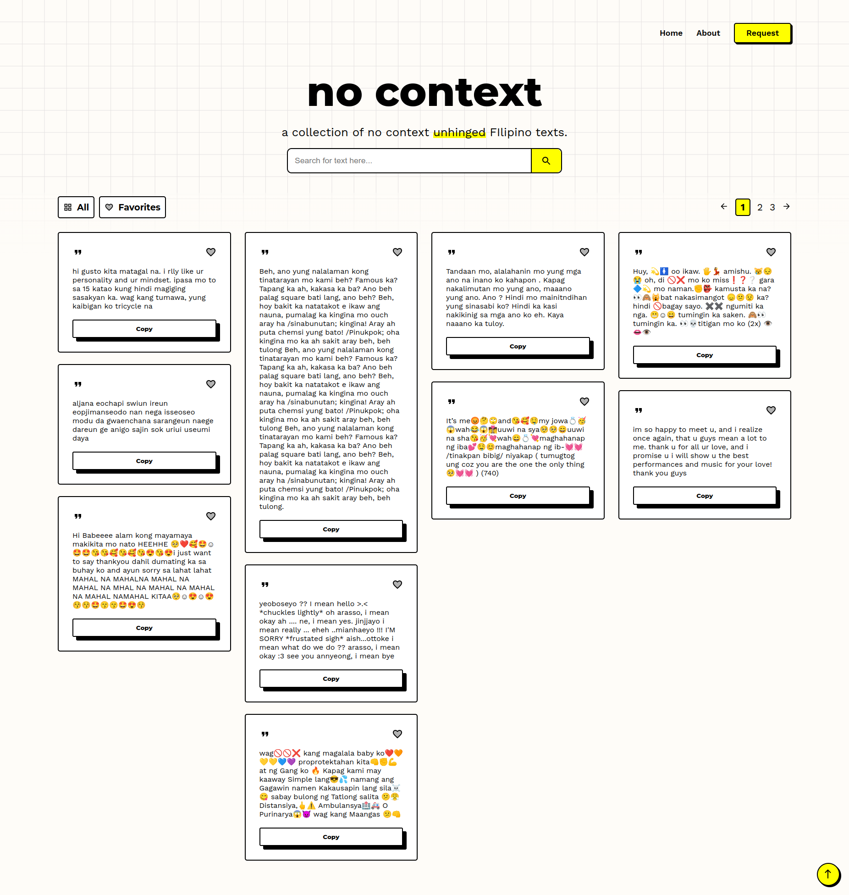

# 👩‍💻 Work In Progress: No Context App (temporary title)
A website where you can copy &amp; paste no context texts to spam your friends' messages or comments section and just have fun together.

## 📖 Table of contents 

- [Overview](#overview)
  - [Features](#features)
  - [Screenshot](#screenshot)
  - [Links](#links)
  - [Built with](#built-with)
  - [Running the App Locally](#running-the-app-locally)
- [Author](#author)

## 🔍 Overview

### Features 📂

Users should be able to:
- View the optimal layout for the site depending on their device's screen size
- Request for their favorite texts to be added on the website by submitting a form
- Search for their favorite text
- Mark cards as their favorite and be able to check it by clicking the 'Favorite' button
- View all cards by selecting a page
- Automatically scroll to top by clicking the designated 'scroll to top' button

### Screenshot 📸

Expected final output:



### Links 🔗

- Solution URL: TBA
- Live Site URL: TBA

### Built with 🔨

- HTML5
- Sass (CSS pre-processor)
- Flexbox
- Mobile-first workflow
- ReactJS
- MaterialUI
- [npmjs](https://www.npmjs.com/)
- [Goole Fonts](https://fonts.google.com/knowledge)

### Running the App Locally 💻
This app runs on Node.js. If Node.js is installed, you may clone the repository and install its dependencies running:
```
npm install
```

## 👩‍💻 Author

- Frontend Mentor - [@sn-tin](https://www.frontendmentor.io/profile/sn-tin)
- Github - [@sn-tin](https://github.com/sn-tin/)